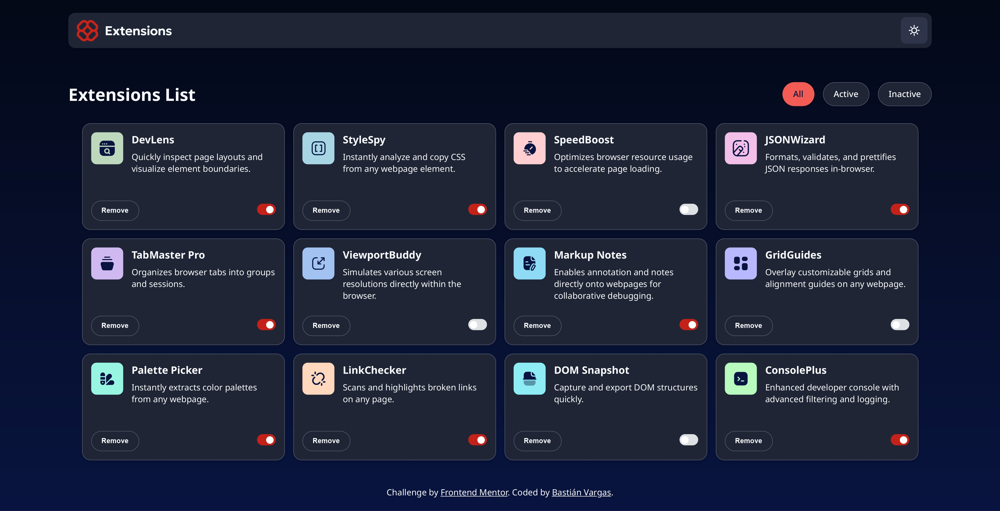

# Frontend Mentor - Browser extensions manager UI solution

This project was a fun way to practice working with dynamic data, filtering data, color theming, building a responsive grid, and more!

This is a solution to the [Browser extensions manager UI challenge on Frontend Mentor](https://www.frontendmentor.io/challenges/browser-extension-manager-ui-yNZnOfsMAp).

### The challenge

Users should be able to:

- Toggle extensions between active and inactive states
- Filter active and inactive extensions
- Remove extensions from the list
- Select their color theme
- View the optimal layout for the interface depending on their device's screen size
- See hover and focus states for all interactive elements on the page

### Screenshot

### Links

- Solution URL: [📖](https://github.com/Riast96/Browser-extension-manager-UI)
- Live Site URL: [🌐](https://riast96.github.io/Browser-extension-manager-UI/)

## My process

### Built with

- Semantic HTML5 markup
- CSS custom properties
- Flexbox
- Mobile-first workflow

### What I learned

In this proyect I learned the use of CSS variables to simplify the workflow and to make easy the change of UI color for example.
I also learned more JavaScript, how to fetcha data, the use of arrays, how to write functions and the use of event listeners.

### Continued development

I would like to learn more about JavaScript and how to make beautiful animations with CSS and JS.

## Author

- Website - [Bastián Vargas](https://riast96.github.io)
- Frontend Mentor - [@Riast96](https://www.frontendmentor.io/profile/Riast96)
